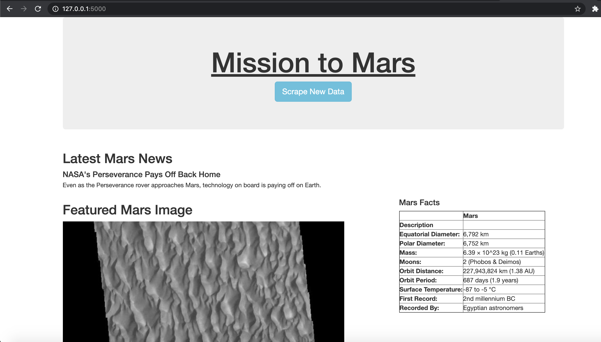

# Mission-to-Mars
Jupyter Notebook and Python script to scrape Mars data from web sources, store
using MongoDB, and visualize using the Python flask framework.

## Resources
- Data Source:
    - [Mars News](https://mars.nasa.gov/news/)
    - [JPL Featured Images](https://data-class-jpl-space.s3.amazonaws.com/JPL_Space/index.html)
    - [Mars Facts](https://space-facts.com/mars/)
    - [Mars Hemispheres](https://astrogeology.usgs.gov/search/results?q=hemisphere+enhanced&k1=target&v1=Mars%22)
- Software:
    - Python 3.7.6
    - Splinter 0.14.0
    - bs4 4.8.2
    - pandas 1.0.1
    - Flask 1.1.1
    - Flask-PyMongo 2.3.0
    - MongoDB 4.4

## Usage
Start MongoDB service using Homebrew (MacOS):
Show service status:
```
$ brew services list
Name              Status  User Plist
mongodb-community stopped
```
Start MongoDB service:
```
$ brew services start mongodb-community
==> Successfully started `mongodb-community` (label: homebrew.mxcl.mongodb-community)
```
Stop MongoDB service:
```
$ brew services stop mongodb-community
Stopping `mongodb-community`... (might take a while)
==> Successfully stopped `mongodb-community` (label: homebrew.mxcl.mongodb-community)
```
Launch Mars webscraping app:
```
$ python app.py
 * Serving Flask app "app" (lazy loading)
 * Environment: production
   WARNING: This is a development server. Do not use it in a production deployment.
   Use a production WSGI server instead.
 * Debug mode: off
 * Running on http://127.0.0.1:5000/ (Press CTRL+C to quit)

```
Launch browser to the hostname shown and select "Scape New Data" to acquire
Mars data:

